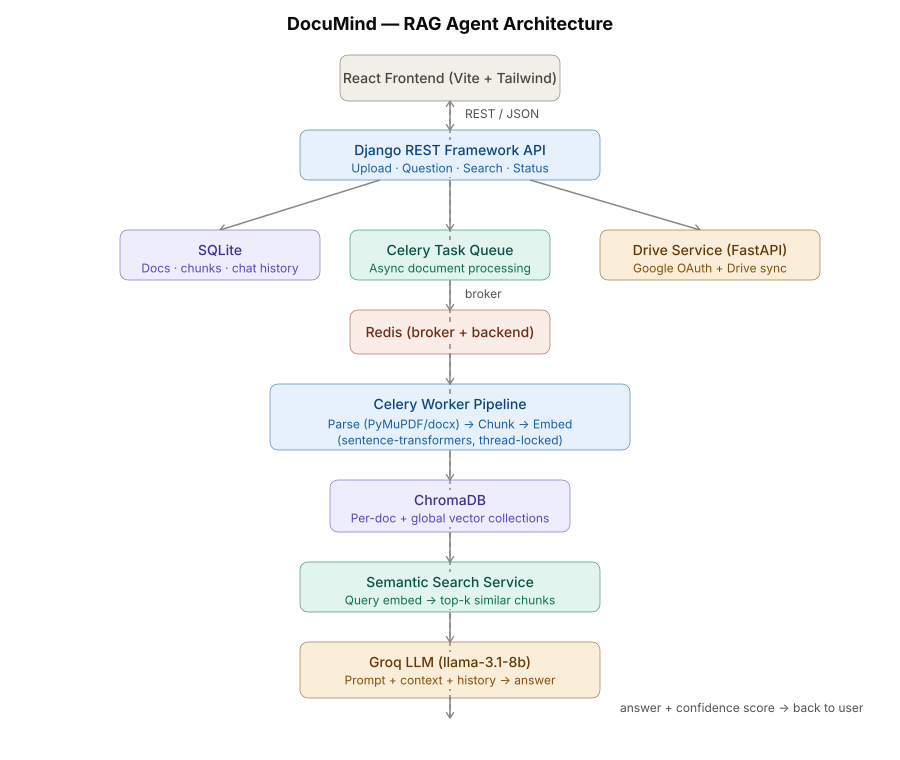

# DocuMind - Backend Documentation

## Table of Contents

- [Overview](#overview)
- [Project Structure](#project-structure)
- [Technology Stack](#technology-stack)
- [Installation & Setup](#installation--setup)
- [Configuration](#configuration)
- [API Reference](#api-reference)
- [Database Models](#database-models)
- [Services Layer](#services-layer)
- [Background Tasks](#background-tasks)
- [Utilities](#utilities)
- [Development Guidelines](#development-guidelines)

---

## Overview

DocuMind is a **RAG (Retrieval-Augmented Generation)** based document question-answering system built with Django. It allows users to upload documents (PDF, DOC, DOCX, TXT), processes them into chunks, generates embeddings, and enables natural language questioning against document content.

### Key Features

- **Document Upload & Management** - Upload, list, and delete documents
- **Semantic Search** - Search across all documents using vector similarity
- **Q&A System** - Ask questions and get AI-powered answers from documents
- **Chat History** - Maintain conversation history per document
- **Google Drive Integration** - Sync documents from Google Drive
- **Async Processing** - Background document processing with Celery

---

## Project Structure

## Architecture



The system follows a request-response flow split into two main pipelines:

**Upload & Indexing Pipeline:**

1. User uploads a document via the React frontend
2. Django API saves metadata to SQLite and queues an async Celery task
3. Celery worker (via Redis broker) parses the file, splits it into chunks, and generates embeddings using sentence-transformers
4. Chunks + embeddings are stored in ChromaDB (per-document and global collections)

**Question & Answer Pipeline:**

1. User submits a question tied to a document (or global search)
2. The question is embedded and matched against ChromaDB using cosine similarity
3. Top-k relevant chunks are retrieved and passed as context to the Groq LLM along with conversation history
4. The LLM generates an answer, along with a confidence score based on retrieval similarity

```

/workspace
├── documind/                 # Django project configuration
│   ├── __init__.py
│   ├── asgi.py              # ASGI config for async support
│   ├── celery.py            # Celery configuration
│   ├── settings.py          # Django settings
│   ├── urls.py              # Root URL routing
│   └── wsgi.py              # WSGI config for deployment
│
├── rag/                      # Main application module
│   ├── models.py            # Database models (UploadedDocument, ChatHistory, etc.)
│   ├── views.py             # API endpoints (APIView classes)
│   ├── urls.py              # URL routing for rag app
│   ├── serializers.py       # DRF serializers for request/response validation
│   ├── tasks.py             # Celery background tasks
│   ├── admin.py             # Django admin configuration
│   ├── services/            # Business logic layer
│   │   ├── __init__.py
│   │   ├── document_service.py    # Document CRUD operations
│   │   ├── qa_service.py          # Question answering logic
│   │   ├── search_service.py      # Search functionality
│   │   └── drive_service.py       # Google Drive integration
│   ├── utils/               # Utility modules
│   │   ├── __init__.py
│   │   ├── vector_store.py        # ChromaDB vector operations
│   │   ├── rag_engine.py          # LLM interaction & prompt building
│   │   └── pdf_processor.py       # Document parsing utilities
│   ├── migrations/          # Database migrations
│   └── management/          # Custom Django management commands
│
├── drive_service/            # Standalone Google Drive service
│   ├── main.py              # FastAPI application
│   ├── auth.py              # Google OAuth authentication
│   ├── drive_client.py      # Google Drive API client
│   ├── config.py            # Configuration settings
│   └── schemas.py           # Pydantic schemas
│
├── frontend/                 # Frontend application (React/Vite)
├── manage.py                 # Django management script
├── requirements.txt          # Python dependencies
└── .env.example              # Environment variables template
```

---

## Technology Stack

### Backend Framework

- **Django 6.0.6** - Web framework
- **Django REST Framework 3.17.1** - API development

### Database & Storage

- **SQLite3** - Primary database (with 30s write-lock timeout for concurrency)
- **ChromaDB 1.5.9** - Vector database for embeddings

### Task Queue

- **Celery 5.4.0** - Distributed task queue
- **Redis 5.0.8** - Message broker & result backend

### AI/ML

- **Groq 1.5.0** - LLM inference API
- **Sentence Transformers 5.6.0** - Text embedding generation

### Document Processing

- **PyMuPDF 1.28.0** - PDF parsing
- **python-docx 1.2.0** - Word document parsing

### Utilities

- **python-decouple 3.8** - Environment variable management
- **django-cors-headers** - CORS support

---

## Installation & Setup

### Prerequisites

- Python 3.10+
- Redis server running on `localhost:6379`
- Google Cloud credentials (for Drive integration)
- Groq API key

### Step-by-Step Installation

1. **Clone and navigate to project**

   ```bash
   cd /workspace
   ```

2. **Create virtual environment**

   ```bash
   python -m venv venv
   source venv/bin/activate  # On Windows: venv\Scripts\activate
   ```

3. **Install dependencies**

   ```bash
   pip install -r requirements.txt
   ```

4. **Configure environment variables**

   ```bash
   cp .env.example .env
   # Edit .env with your credentials
   ```

5. **Run migrations**

   ```bash
   python manage.py migrate
   ```

6. **Start services**

   **Terminal 1 - Redis** (if not running):

   ```bash
   redis-server
   ```

   **Terminal 2 - Celery Worker**:

   ```bash
   celery -A documind worker --loglevel=info
   ```

   **Terminal 3 - Django Server**:

   ```bash
   python manage.py runserver
   ```

   **Terminal 4 - Drive Service** (optional):

   ```bash
   cd drive_service
   uvicorn main:app --port 8001
   ```

---

## Configuration

### Environment Variables (.env)

```bash
# Django Settings
SECRET_KEY=your-secret-key-here
DEBUG=True

# Celery & Redis
CELERY_BROKER_URL=redis://localhost:6379/0
CELERY_RESULT_BACKEND=redis://localhost:6379/0

# Groq API (for LLM)
GROQ_API_KEY=your-groq-api-key

# Google Drive (optional)
GOOGLE_CLIENT_ID=your-client-id
GOOGLE_CLIENT_SECRET=your-client-secret
GOOGLE_REDIRECT_URI=http://127.0.0.1:8001/callback
```

### Django Settings Highlights

- **Media Files**: Stored in `/workspace/media/`
- **Static Files**: Served at `/static/`
- **CORS Origins**:
  - `http://localhost:3000`
  - `http://127.0.0.1:3000`
  - `http://10.223.216.28:3000`
- **Database Timeout**: 30 seconds (for concurrent bulk operations)

---

## API Reference

Base URL: `http://localhost:8000/api/`

### 1. Document Management

#### List All Documents

```http
GET /api/list/
```

**Response:**

```json
{
  "success": true,
  "data": [
    {
      "id": 1,
      "name": "report.pdf",
      "file_type": "pdf",
      "file_size": 1048576,
      "is_processed": true,
      "processing_error": "",
      "chunk_count": 45,
      "created_at": "2025-01-15T10:30:00Z",
      "updated_at": "2025-01-15T10:35:00Z"
    }
  ]
}
```

#### Upload Document

```http
POST /api/upload/
Content-Type: multipart/form-data

FormData:
- file: <binary>
- name: "My Document"
- file_type: "pdf"
```

**Constraints:**

- Max file size: 50MB
- Allowed types: `pdf`, `docx`, `doc`, `txt`

**Response:**

```json
{
  "success": true,
  "data": {
    "id": 1,
    "name": "My Document",
    "file_type": "pdf",
    "is_processed": false,
    ...
  }
}
```

#### Delete Document

```http
DELETE /api/detail/<int:document_id>/
```

**Response:** `204 No Content`

#### Get Document Status

```http
GET /api/status/<int:document_id>/
```

**Response:**

```json
{
  "success": true,
  "data": {
    "id": 1,
    "name": "report.pdf",
    "is_processed": true,
    "processing_error": "",
    "chunk_count": 45
  }
}
```

---

### 2. Question & Answer

#### Ask Question

```http
POST /api/question/
Content-Type: application/json

{
  "question": "What is the main conclusion?",
  "document_id": 1
}
```

**Validation:**

- `question`: 2-1000 characters, non-empty
- `document_id`: Must exist and be processed

**Response:**

```json
{
  "success": true,
  "data": {
    "question": "What is the main conclusion?",
    "answer": "The main conclusion is...",
    "source_chunks": [
      {
        "chunk_text": "...",
        "page_number": 5,
        "chunk_index": 12
      }
    ],
    "document_name": "report.pdf",
    "confidence_score": 0.87
  }
}
```

**Error Cases:**

- `400 Bad Request` - Document not processed or invalid input
- `404 Not Found` - Document doesn't exist

---

### 3. Chat History

#### Get Chat History

```http
GET /api/history/<int:document_id>/
```

**Response:**

```json
{
  "success": true,
  "data": [
    {
      "id": 1,
      "document": 1,
      "question": "What is X?",
      "answer": "X is...",
      "created_at": "2025-01-15T11:00:00Z"
    }
  ]
}
```

#### Clear Chat History

```http
DELETE /api/history/<int:document_id>/
```

**Response:** `204 No Content`

---

### 4. Search

#### Global Search

```http
GET /api/search/?query=<search_query>
```

**Parameters:**

- `query` (optional): Search text. If empty, returns all documents.

**Response:**

```json
{
  "results": [...],
  "query": "machine learning"
}
```

---

### 5. Google Drive Sync

#### Sync Drive Documents

```http
POST /api/sync-drive/
```

**Description:** Fetches files from Google Drive and queues them for processing.

**Response:**

```json
{
  "status": "success",
  "synced_count": 5,
  "failed_count": 0
}
```

---

## Database Models

### UploadedDocument

Stores metadata about uploaded files.

| Field                   | Type            | Description                                |
| ----------------------- | --------------- | ------------------------------------------ |
| `id`                    | AutoField       | Primary key                                |
| `name`                  | CharField(255)  | File name                                  |
| `file`                  | FileField       | Uploaded file (path: `uploads/documents/`) |
| `file_type`             | CharField(10)   | Type: pdf, doc, docx, txt                  |
| `file_size`             | BigIntegerField | Size in bytes                              |
| `is_processed`          | BooleanField    | Processing completion flag                 |
| `processing_started_at` | DateTimeField   | When processing began                      |
| `processing_error`      | TextField       | Error message if failed                    |
| `created_at`            | DateTimeField   | Auto timestamp                             |
| `updated_at`            | DateTimeField   | Auto timestamp                             |

**Properties:**

- `file_size_mb` - File size in MB
- `chunk_count` - Number of associated chunks

---

### DocumemtsChunks

Stores document chunks with embeddings.

| Field         | Type          | Description                 |
| ------------- | ------------- | --------------------------- |
| `document`    | ForeignKey    | Link to UploadedDocument    |
| `chunk_text`  | TextField     | Text content of chunk       |
| `chunk_size`  | IntegerField  | Character count             |
| `chunk_index` | IntegerField  | Sequential order            |
| `embedding`   | JSONField     | Vector embedding (nullable) |
| `page_number` | IntegerField  | Source page number          |
| `created_at`  | DateTimeField | Auto timestamp              |

**Relations:**

- Reverse relation from UploadedDocument: `document.chunks.all()`

---

### ChatHistory

Stores Q&A conversation history.

| Field        | Type          | Description         |
| ------------ | ------------- | ------------------- |
| `document`   | ForeignKey    | Associated document |
| `question`   | TextField     | User's question     |
| `answer`     | TextField     | AI's response       |
| `created_at` | DateTimeField | Auto timestamp      |

---

### DriveDocument

Tracks Google Drive synced files.

| Field               | Type           | Description                          |
| ------------------- | -------------- | ------------------------------------ |
| `drive_file_id`     | CharField(255) | Google Drive file ID (unique)        |
| `name`              | CharField(500) | File name                            |
| `mime_type`         | CharField(100) | MIME type                            |
| `drive_modified_at` | DateTimeField  | Last modified on Drive               |
| `sync_status`       | CharField(20)  | pending, processing, indexed, failed |
| `sync_error`        | TextField      | Sync error message                   |
| `document`          | OneToOneField  | Linked UploadedDocument (nullable)   |

---

## Services Layer

Business logic is separated into service classes for maintainability.

### DocumentService

Location: `rag/services/document_service.py`

```python
# Create and queue document for processing
document = DocumentService.create_and_process(file, name, file_type)

# Delete document and cleanup vector store
DocumentService.delete(document_id)

# List all documents
documents = DocumentService.list_all()

# Get processing status
status = DocumentService.get_status(document_id)
```

**Key Operations:**

- Creates `UploadedDocument` record
- Triggers async `process_document_task`
- Deletes ChromaDB collections on document deletion
- Handles transactional integrity

---

### QAService

Location: `rag/services/qa_service.py`

```python
result = QAService.answer_question(question, document_id)
```

**Workflow:**

1. Validates document is processed
2. Retrieves chat history for context
3. Searches similar chunks via vector store
4. Builds context and prompt
5. Generates answer via Groq LLM
6. Calculates confidence score
7. Stores Q&A in ChatHistory

**Returns:**

```python
{
    "question": str,
    "answer": str,
    "source_chunks": list,
    "document_name": str,
    "confidence_score": float
}
```

---

### SearchService

Location: `rag/services/search_service.py`

```python
# Search with query
results = SearchService.search("machine learning")

# Browse all (no query)
results = SearchService.browse()
```

---

### DriveService

Location: `rag/services/drive_service.py`

```python
# Sync Google Drive files
result = sync_drive_documents()
```

**Process:**

1. Calls external drive_service (port 8001)
2. Creates/updates DriveDocument records
3. Queues documents for processing

---

## Background Tasks

### Celery Configuration

Location: `documind/celery.py`

```python
# Broker: Redis
# Backend: Redis
# Task serializer: JSON
# Late acknowledgment: Enabled
```

### process_document_task

Location: `rag/tasks.py`

**Signature:**

```python
@app.task(bind=True, acks_late=True)
def process_document_task(self, document_id):
    ...
```

**Workflow:**

1. Fetch document from DB
2. Update status to "processing"
3. Parse document (PDF/DOCX/TXT)
4. Split into chunks
5. Generate embeddings (sentence-transformers)
6. Store in ChromaDB (per-document collection)
7. Store global chunks
8. Update `is_processed` flag
9. Handle errors and rollback

**Error Handling:**

- Sets `processing_error` field
- Logs failures
- Allows retry via Celery

---

## Utilities

### vector_store.py

Location: `rag/utils/vector_store.py`

**Functions:**

- `search_similar_chunks(query, document_id, top_k)` - Semantic search
- `delete_document_collection(document_id)` - Remove per-document collection
- `delete_global_document_chunks(document_id)` - Cleanup global index
- `add_chunks_to_collection(...)` - Insert chunks with embeddings

**ChromaDB Strategy:**

- Per-document collection: `document{document_id}`
- Global collection for cross-document search

---

### rag_engine.py

Location: `rag/utils/rag_engine.py`

**Functions:**

- `build_context(chunks)` - Concatenate chunk texts
- `build_prompt(question, context, history)` - Create LLM prompt with conversation history
- `generate_answer(prompt)` - Call Groq API
- `calculate_confidence(chunks)` - Compute relevance score

**Prompt Template:**
Includes:

- System instructions
- Conversation history
- Retrieved context
- User question

---

### pdf_processor.py

Location: `rag/utils/pdf_processor.py`

**Functions:**

- Extract text from PDF/DOCX/TXT
- Split into configurable chunk sizes
- Preserve page numbers

---

## Development Guidelines

### Adding New API Endpoints

1. **Create View** in `rag/views.py`:

```python
class MyNewView(APIView):
    def get(self, request):
        # Your logic
        return Response({"data": ...})
```

2. **Add URL** in `rag/urls.py`:

```python
path('my-endpoint/', MyNewView.as_view(), name='my-endpoint'),
```

3. **Create Serializer** (if needed) in `rag/serializers.py`

4. **Add Service Method** (if business logic needed) in `rag/services/`

---

### Creating New Models

1. **Define Model** in `rag/models.py` with proper `verbose_name`
2. **Create Migration**:
   ```bash
   python manage.py makemigrations
   python manage.py migrate
   ```
3. **Register in Admin** (optional) in `rag/admin.py`
4. **Create Serializer** for API exposure

---

### Best Practices

**Do:**

- Use service layer for business logic (not views)
- Validate input with serializers
- Handle exceptions gracefully
- Log errors with proper context
- Use transactions for multi-step DB operations
- Add verbose names to models for admin interface

**Don't:**

- Put business logic in views
- Skip input validation
- Ignore exception handling
- Make blocking calls in request handlers (use Celery)

---

### Testing

```bash
# Run tests
python manage.py test rag

# With coverage
coverage run manage.py test rag
coverage report
```

---

### Management Commands

Custom commands location: `rag/management/commands/`

**Example:**

```bash
# Requeue stuck documents
python manage.py requeue_stuck_documents
```

---

## Troubleshooting

### Common Issues

**1. "database is locked" error**

- Cause: Concurrent writes exceeding SQLite timeout
- Solution: Already set to 30s; reduce concurrent bulk operations

**2. "Document is still being processed"**

- Cause: Asking questions before processing completes
- Solution: Check `is_processed` flag or `status` endpoint first

**3. Celery tasks not executing**

- Verify Redis is running: `redis-cli ping` → `PONG`
- Check Celery worker logs
- Ensure broker URL matches

**4. ChromaDB collection errors**

- Collections are named `document{document_id}`
- Orphaned collections may need manual cleanup

---

## Deployment Considerations

### Production Checklist

- [ ] Set `DEBUG=False`
- [ ] Use PostgreSQL instead of SQLite
- [ ] Configure production Redis
- [ ] Set up multiple Celery workers
- [ ] Use environment variables for secrets
- [ ] Configure proper logging
- [ ] Set up monitoring (Celery Flower, Sentry)
- [ ] Enable HTTPS
- [ ] Review CORS origins
- [ ] Set up backup strategy for DB and media files

### Scaling

- **Horizontal**: Multiple Django instances behind load balancer
- **Celery**: Scale workers based on queue depth
- **ChromaDB**: Consider Chroma cloud or alternative vector DB for high load
- **Database**: Migrate to PostgreSQL for better concurrency

---

## API Quick Reference Card

| Endpoint             | Method | Description           |
| -------------------- | ------ | --------------------- |
| `/api/upload/`       | POST   | Upload new document   |
| `/api/list/`         | GET    | List all documents    |
| `/api/detail/<id>/`  | DELETE | Delete document       |
| `/api/status/<id>/`  | GET    | Get processing status |
| `/api/question/`     | POST   | Ask question          |
| `/api/history/<id>/` | GET    | Get chat history      |
| `/api/history/<id>/` | DELETE | Clear chat history    |
| `/api/search/`       | GET    | Global search         |
| `/api/sync-drive/`   | POST   | Sync Google Drive     |

---

## Support & Contributing

For issues or contributions:

1. Check existing documentation
2. Follow code style (PEP 8)
3. Add tests for new features
4. Update documentation as needed

---

## Documentation

Detailed documentation is available in the `/docs` directory:

- **[Quick Start Guide](./docs/QUICKSTART.md)** - Get up and running in minutes
- **[API Reference](./docs/API.md)** - Complete API documentation with examples
- **[Architecture Overview](./docs/ARCHITECTURE.md)** - System design and architecture details

---

_Last Updated: August 2025_
_Version: 1.0.0_
